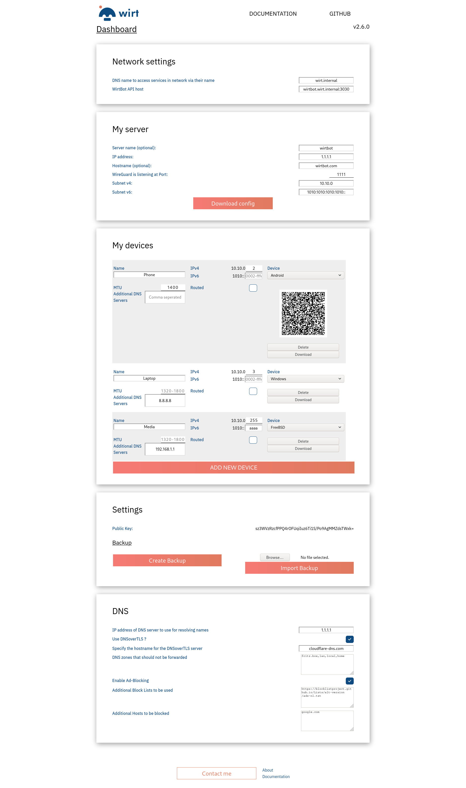

# What is a WirtBot?

WirtBot is a combination of software tools to manage small to medium sized private networks.
It uses state of the art technologies of the Linux and Cloud-native world to provide great speed and security.

Whether you would like to make your self-hosted services available to friends and family, or want to create an intranet for your company - WirtBot has your back.

On top of all that the setup is straight forward and very simple if you have used Docker before.

It is a real Virtual Private Network to serve as a base layer for whatever project you have.

Oh, and it is completely free. My way of paying back to the OSS community for all the knowledge it shares with the world.

## What is included?

- Dashboard to create and manage WireGuard based networks
- DNS zones for all connected devices
- DNS forwarding, including DNSoverTLS
- Real time metrics to be used with Prometheus
	- Port **9586**: [WireGuard](https://github.com/MindFlavor/prometheus_wireguard_exporter)
	- Port **9153**: [CoreDNS](https://coredns.io/plugins/metrics/)
- Backup functionality
- Modern crypto-aware API to keep the WirtBot only under your control
- Extensive testing of the System is done on each change to the code to ensure correctness
- Works on ARM64 and X64

## Setup

Follow the instructions on the [websire](https://b-m-f.github.io/wirtbot).

## Screenshot

## Projects that make this possible

These are some of the giants on whose shoulders the WirtBot is build

- [WireGuard® ](https://wireguard.com)
- [coredns](https://coredns.io/)
- [VueJs](https://v3.vuejs.org/)
- [VuePress](https://vuepress.vuejs.org/)
- [docker](https://www.docker.com/)
- [playwright](https://playwright.dev/)
- [wasm-pack](https://rustwasm.github.io/docs/wasm-pack/)
- [warp](https://github.com/seanmonstar/warp)
- [ed25519-dalek](https://github.com/dalek-cryptography/ed25519-dalek)

## Support

- [reddit](https://reddit.com/r/WirtBot)

## Documentation

### Users

- [WirtBot Documentation](https://b-m-f.github.io/wirtbot/documentation)

### Admins & Developers

Check out the [Documentation](./Documentation) directory.

## LICENSE

The licenses were chosen to ensure that the project will stay free for everyone, and allows safer networks for people to build things on.

The WirtBot and Interface are licensed with `GNU Affero General Public License v3.0`

The documentation and WirtBot logo are provided under `Attribution-ShareAlike 4.0 International (CC BY-SA 4.0)`
