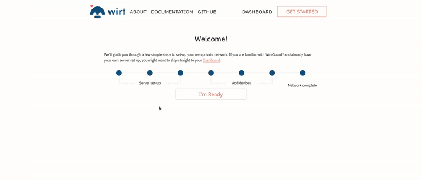

# Wirt
Easily and securely extend your network into the cloud 

Welcome to the [Wirt](https://wirt.network) repository.
What can you find here?:

- Setup scripts
- Wirt documentation
- Wirt developer documentation
- WirtBot
- Interface

Read the documentation at [wirt.network/docs](https://wirt.network) and get your own network running with 1 command on the terminal and a few clicks in your browser.

## Features

- Automatic generation of WireGuard configurations, including keys, directly in the browser
- Every configuration in the network is kept updated on changes
- If configured, all configurations will automatically be sent to the [WirtBot](https://github.com/b-m-f/wirt/WirtBot)
- WirtBot then automatically applies the configuration and immediately activates it
- Export and Import feature to keep track of multiple networks and generate Backups
- Automatic state retention in local storage
- Absolutely no tracking, each application is unique to a users browser
- Communication is guaranteed to only be between linked Interface and WirtBot by cryptographic signatures

## Contributing

You want to help out making Wirt better? **AWESOME**!.

Please feel free to open up an issue here in Github to discuss what you would want to do, and what kind of help we can give you.
I also encourage you to ask questions! My goal is to document as many of those questions as I can, to allow more people to understand what is going on in the code.

For an overview of things that need help check the [issues](https://github.com/b-m-f/wirt/issues).

Other things that need help:

- Translate it into a language that you know

Please check out the `developers-docs` directory for more details on the application.

## LICENSE

The WirtBot and Interface are licensed with `GNU Affero General Public License v3.0`

The documentation and Wirt logo are provided under `Attribution-ShareAlike 4.0 International (CC BY-SA 4.0)`

## Donate

Would you like to contribute a bit to the server costs? ~10$ a month.

You can easily do so to the Ethereum address: `0x39DF85776c626117B945afECF08C4DD262817522`
