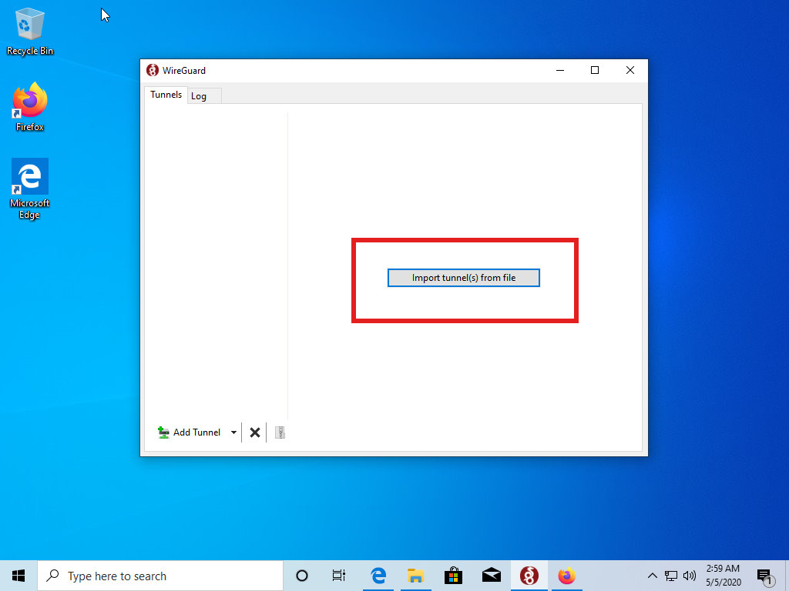

# Joining a network

You have received a configuration file for a WirtBot network?

Follow the guide for your the operating system you use to join it.

- [Android](#android)
- [Windows](#windows)
- [iOS](#ios)

## Windows

**First download the WireGuard® software from** [https://wireguard.com](https://wireguard.com)

**Now click on this button to import your config**

**Go to the folder where you downloaded your config file and select it**

**The config is now imported. Click activate to join the network**

**Congratulations, you are now connected!**

## Android

**First install the WireGuard app**

**Now open it up and click the blue button to add a config**

**You can choose between different ways to add a config, the easiest way is to simply scan a QR code**

**Point your camera at the QR code**

**Give a name for the network**

**Your network is now set up, but not connected. Toggle the switch to get in**

**All done! You are now connected to the network**

## iOS

I do not have a device yet. If you have got a few minutes please be so kind to add a few screenshots via [https://github.com/b-m-f/WirtBot](https://github.com/b-m-f/WirtBot)
