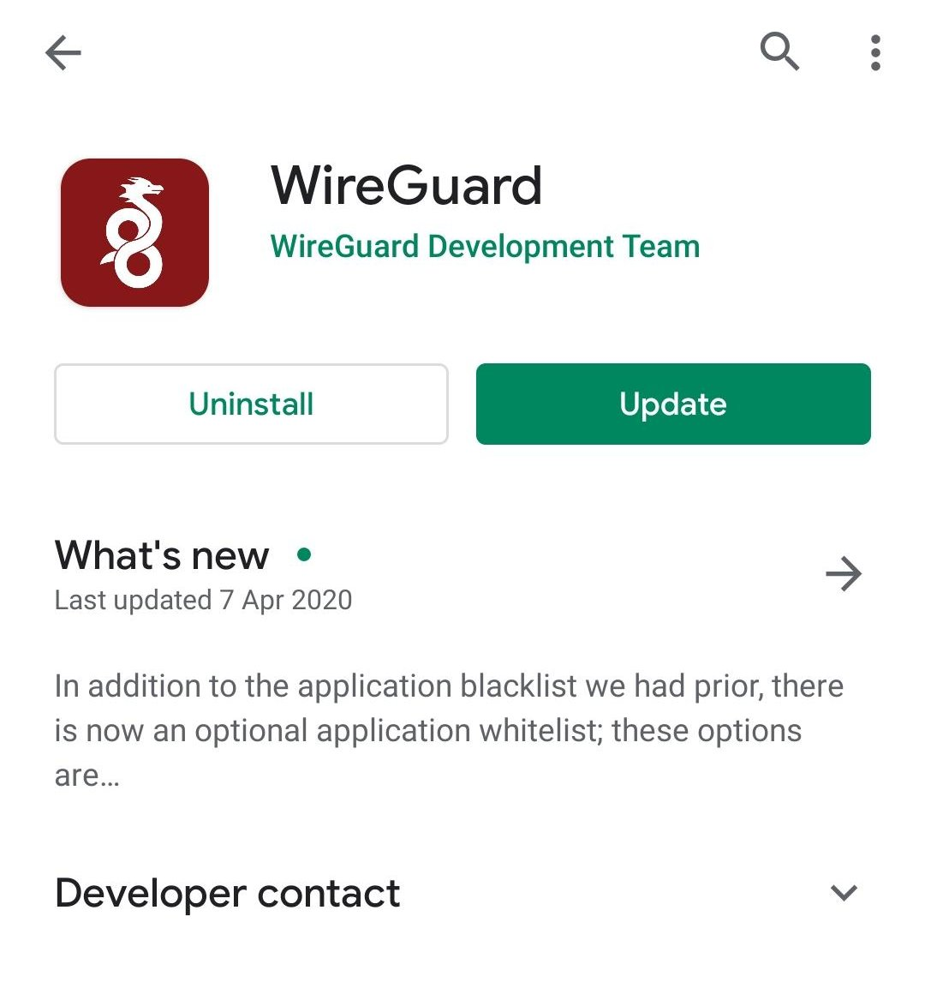
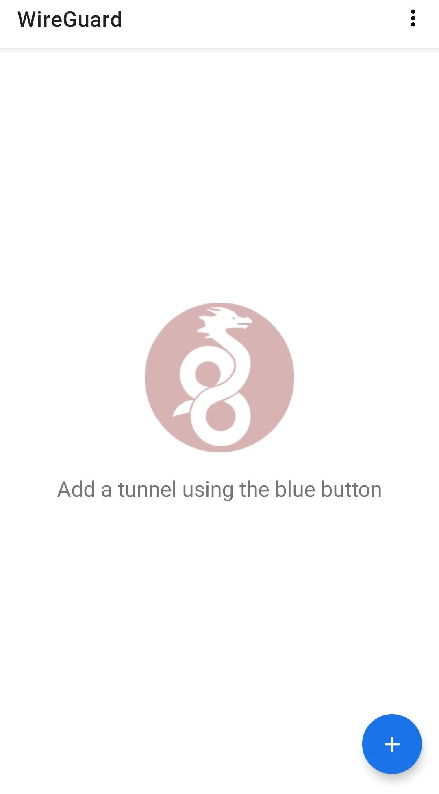
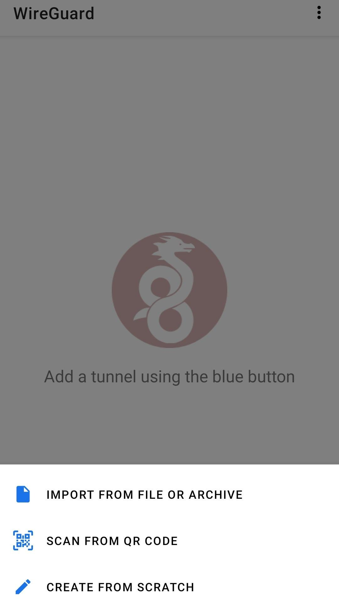
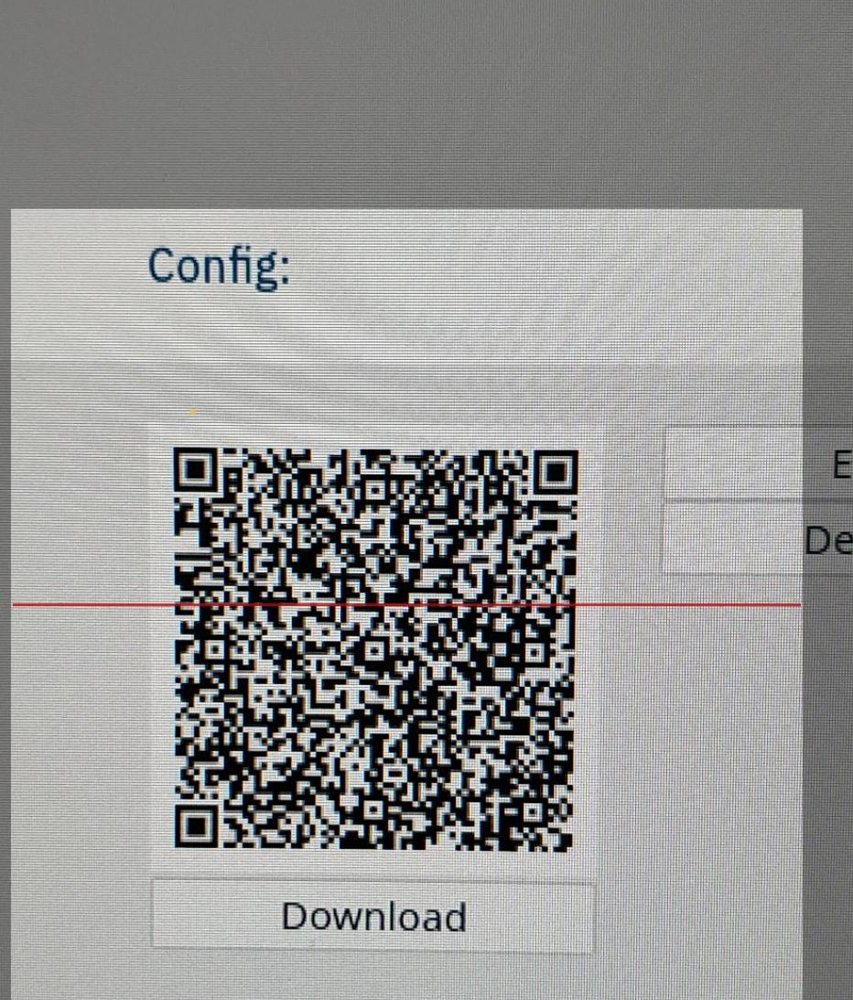
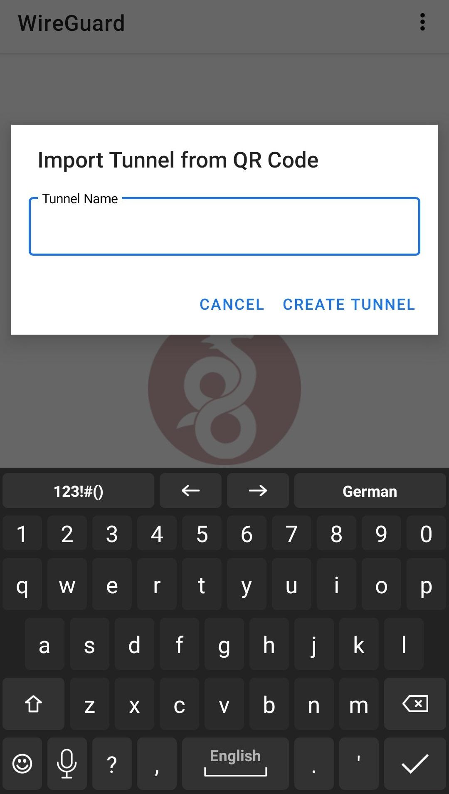
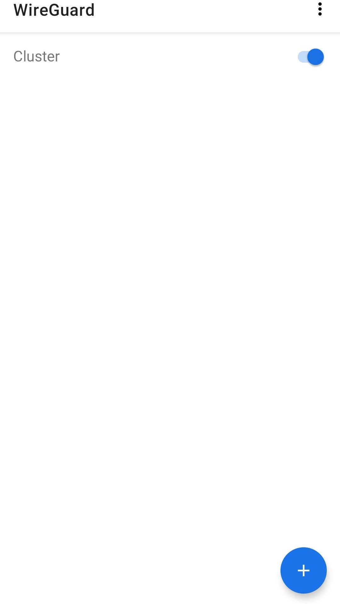

## Android

**First install the WireGuard app**

**Now open it up and click the blue button to add a config**

**You can choose between different ways to add a config, the easiest way is to simply scan a QR code**

**Point your camera at the QR code**

**Give a name for the network**

**Your network is now set up, but not connected. Toggle the switch to get in**

**All done! You are now connected to the network**

