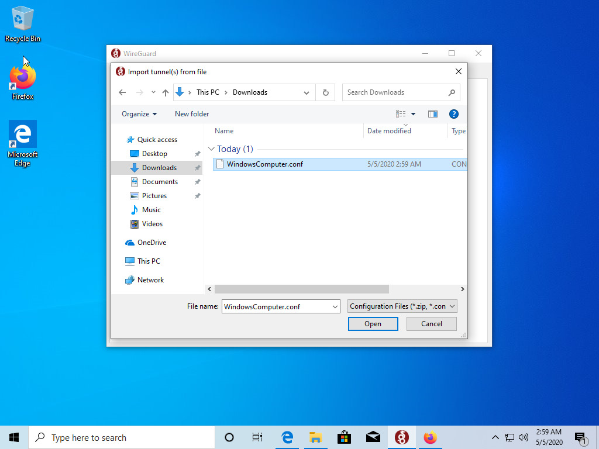

## Windows

**First download the WireGuard® software from** [https://wireguard.com](https://wireguard.com)

**Now click on this button to import your config**

**Go to the folder where you downloaded your config file and select it**

**The config is now imported. Click activate to join the network**

**Congratulations, you are now connected!**

