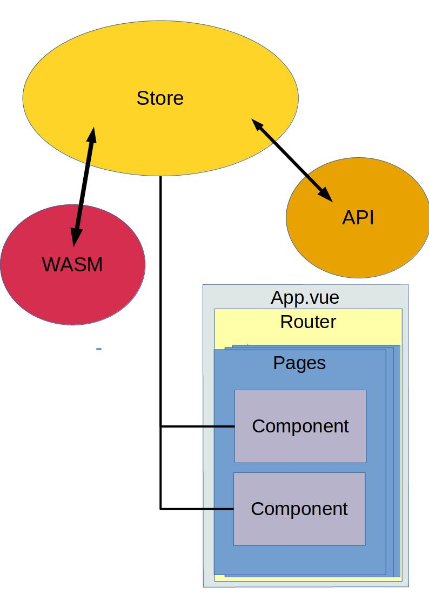

# Architecture

The architecture of the app is intended to give clear roles to different parts, so that responsibility for certain tasks can easily be attributed.

## Communication

One thing to consider:

- Who needs the result?

The store should be used for data that multiple components need.

Need some data that is only needed in your component? Use the API directly. But no result can go into the state.

## Automate

Use the single State to your advantage.
Do you want to update the WirtBot on every configuration change? Dont write code for that in your component!
Simply call the API in the **action** that you call via `dispatch()`. Now you have one less thing to worry about and only one place to fix if things break
