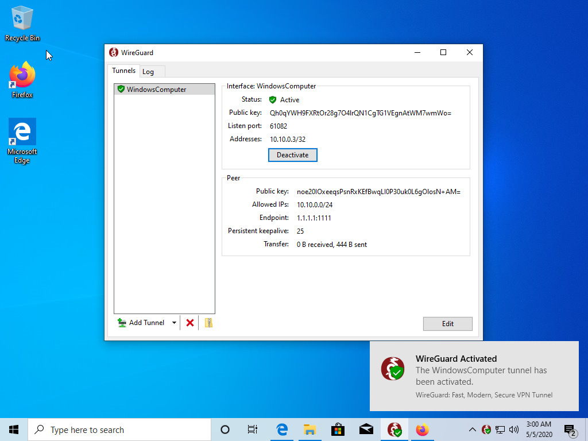
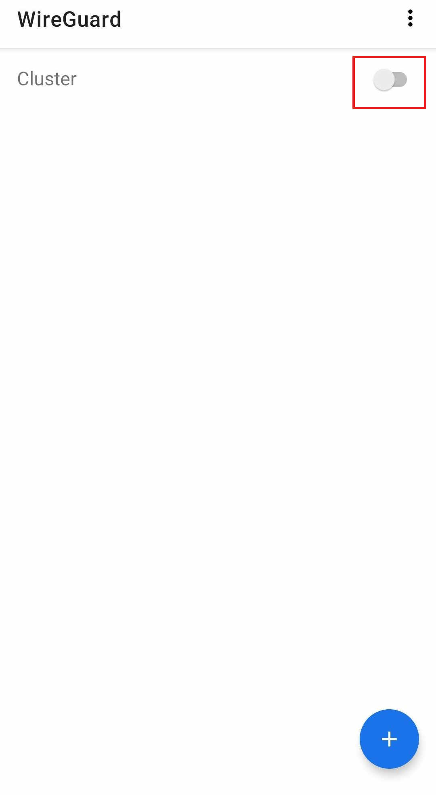

# Joining a network

You have received a configuration file for a WirtBot network?

Follow the guide for your the operating system you use to join it.

- [Linux](#linux)
- [Windows](#windows)
- [Android](#android)
- [iOS](#ios)

## Linux

First install Wireguard:

- Debian: `sudo apt-get install wireguard wireguard-tools`
- Arch Linux: `sudo pacman -S wireguard-tools`

Now copy the config that you downloaded to `/etc/wireguard`. You will need **sudo** for this operation, as the `/etc/wireguard` directory is protected.

To test things out run `sudo wg-quick@DeviceName`. **wg-quick** will automatically check the `/etc/wireguard` directory for the correct config, in this cast `DeviceName.conf`.

The connection should be established. You can check this with `sudo wg`.

### Making the connection permanent

If you want to stay connected you can enable this via `systemctl`.

Typing `sudo systemctl enabled --now wg-quick@DeviceName` will start a system service that will establish the connection on every reboot - if your system is using **SystemD**.

## Windows

**First download the WireGuard® software from** [https://wireguard.com](https://wireguard.com)

**Now click on this button to import your config**

**Go to the folder where you downloaded your config file and select it**

**The config is now imported. Click activate to join the network**

**Congratulations, you are now connected!**

## Android

**First install the WireGuard app**

**Now open it up and click the blue button to add a config**

**You can choose between different ways to add a config, the easiest way is to simply scan a QR code**

**Point your camera at the QR code**

**Give a name for the network**

**Your network is now set up, but not connected. Toggle the switch to get in**

**All done! You are now connected to the network**

## iOS

- Download Wireguard App from AppStore
- Scan QR code with the app
- Establish the connection

I do not have an iOS device to test this. If you have got a few minutes please be so kind to add a few screenshots via [https://github.com/b-m-f/WirtBot](https://github.com/b-m-f/WirtBot)
